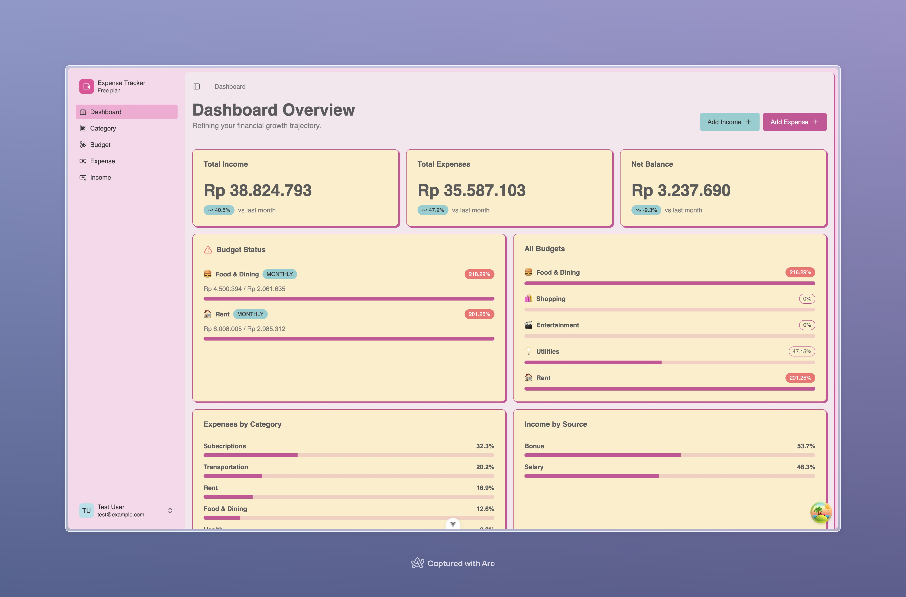
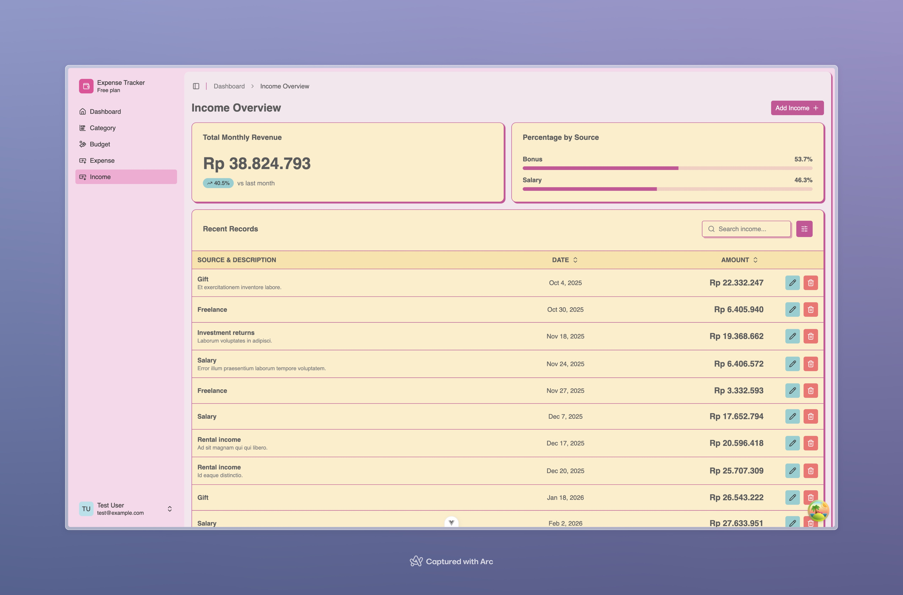
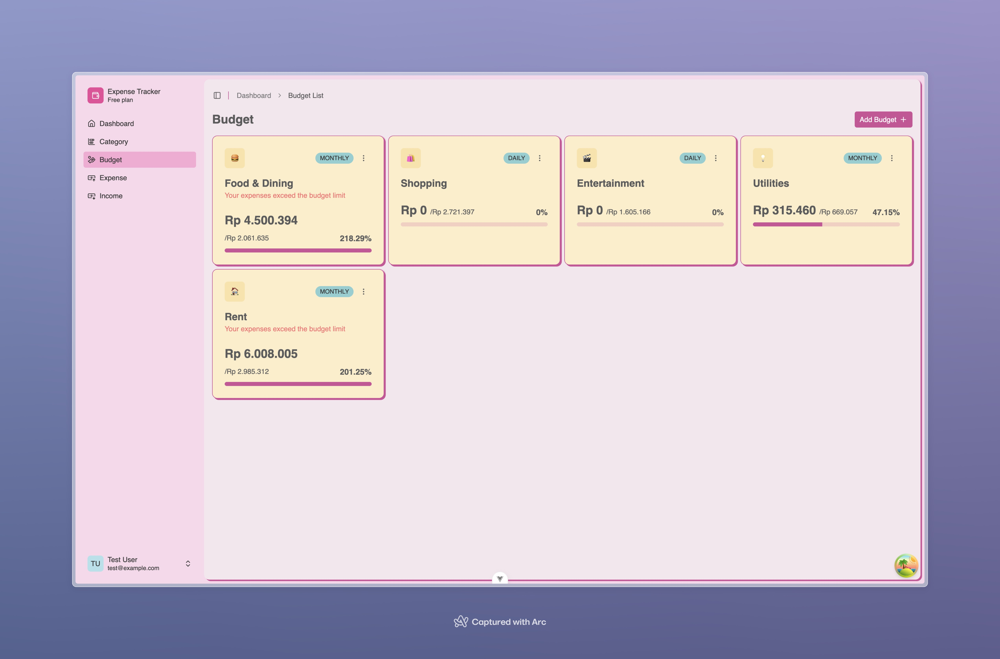

# 💰 Expense Tracker

A full-stack personal finance application for tracking expenses, income, budgets, and categories — built with **Vue 3** and **Laravel 13**.



## ✨ Features

- **Dashboard** — At-a-glance overview of your financial health with income vs. expense breakdowns
- **Expense Tracking** — Log and categorize every purchase with date, amount, and notes
- **Income Management** — Record multiple income sources with monthly detail views
- **Budget Planning** — Set spending limits per category and track progress in real time
- **Custom Categories** — Organize transactions with personalized categories and icons
- **Authentication** — Secure register, login, password reset, and token-based sessions

## 📸 Screenshots

<div align="center">

| Income | Budgets |
|:---:|:---:|
|  |  |

</div>

## 🛠️ Tech Stack

### Frontend


- **State Management** — Pinia 3.0 + TanStack Vue Query 5.95
- **UI Components** — Reka UI (headless) + Lucide icons
- **Forms** — TanStack Vue Form + Zod validation
- **Utilities** — VueUse, date-fns, vue-sonner (toasts)

### Backend


- **Authentication** — Laravel Sanctum (token-based)
- **Testing** — Pest PHP 4.4
- **Code Style** — Laravel Pint

## 📁 Project Structure

```
expense-tracker/
├── backend/              # Laravel API
│   ├── app/
│   │   ├── Http/Controllers/
│   │   ├── Models/
│   │   ├── Services/
│   │   └── Repositories/
│   ├── database/migrations/
│   ├── routes/api.php
│   └── .env.example
├── frontend/             # Vue SPA
│   ├── src/
│   │   ├── features/     # Feature-based modules
│   │   ├── components/   # Shared UI components
│   │   ├── stores/       # Pinia stores
│   │   └── router/       # Vue Router config
│   └── .env
└── README.md
```

## 🔌 API Endpoints

<details>
<summary>Authentication</summary>

| Method | Endpoint                    | Description            |
| ------ | --------------------------- | ---------------------- |
| POST   | `/api/auth/register`        | Register new user      |
| POST   | `/api/auth/login`           | Login                  |
| POST   | `/api/auth/logout`          | Logout (auth required) |
| GET    | `/api/auth`                 | Get current user       |
| POST   | `/api/auth/forgot-password` | Request password reset |
| POST   | `/api/auth/reset-password`  | Reset password         |

</details>

<details>
<summary>Resources (all require authentication)</summary>

| Resource   | Endpoints                                                         |
| ---------- | ----------------------------------------------------------------- |
| Categories | `GET/POST /api/category`, `PUT/DELETE /api/category/{id}`         |
| Budgets    | `GET/POST /api/budget`, `PUT/DELETE /api/budget/{id}`             |
| Income     | `GET/POST /api/income`, `PUT/DELETE /api/income/{id}`, `GET /api/income/detail` |
| Expenses   | `GET/POST /api/expense`, `PUT/DELETE /api/expense/{id}`           |

</details>

## 🚀 Getting Started

### Prerequisites

- PHP 8.3+, Composer
- Node.js 20.19+ or 22.12+
- Bun (frontend package manager)
- PostgreSQL

### Backend

```bash
cd backend

# Quick setup (install, env, key, migrate)
composer setup
```

Or manually:

```bash
composer install
cp .env.example .env
php artisan key:generate
```

Configure `.env` with your PostgreSQL credentials, then run migrations:

```bash
php artisan migrate
```

### Frontend

```bash
cd frontend
bun install
```

Create a `.env` file:

```env
VITE_API_URL=http://localhost:8000
```

### Run the App

```bash
# Option 1 — Start everything from backend
cd backend && composer dev

# Option 2 — Start separately
cd backend && php artisan serve   # Terminal 1
cd frontend && bun run dev        # Terminal 2
```

## 🧪 Testing

```bash
cd backend
composer test
```

## 📄 License

This project is open-sourced software.
